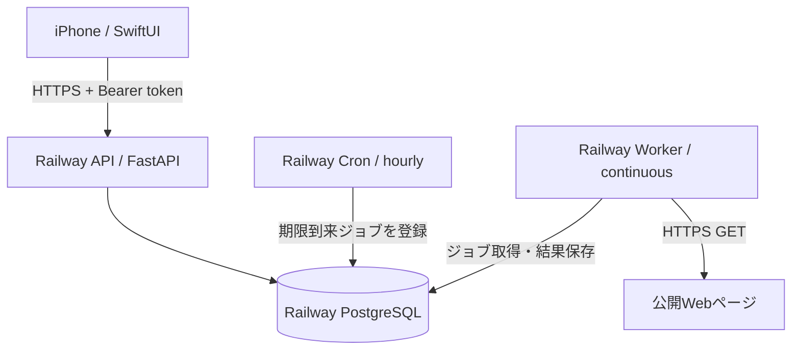
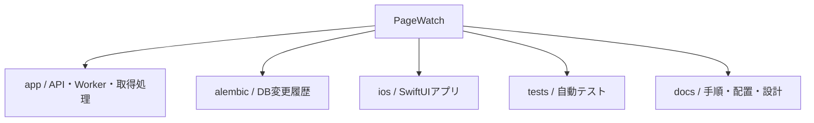
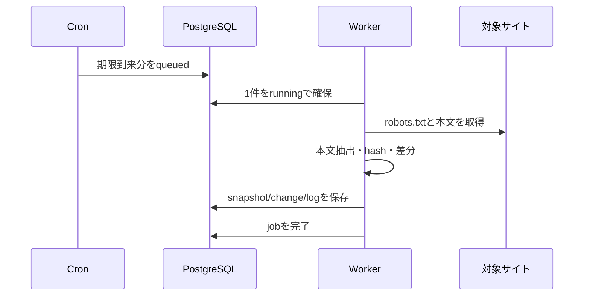
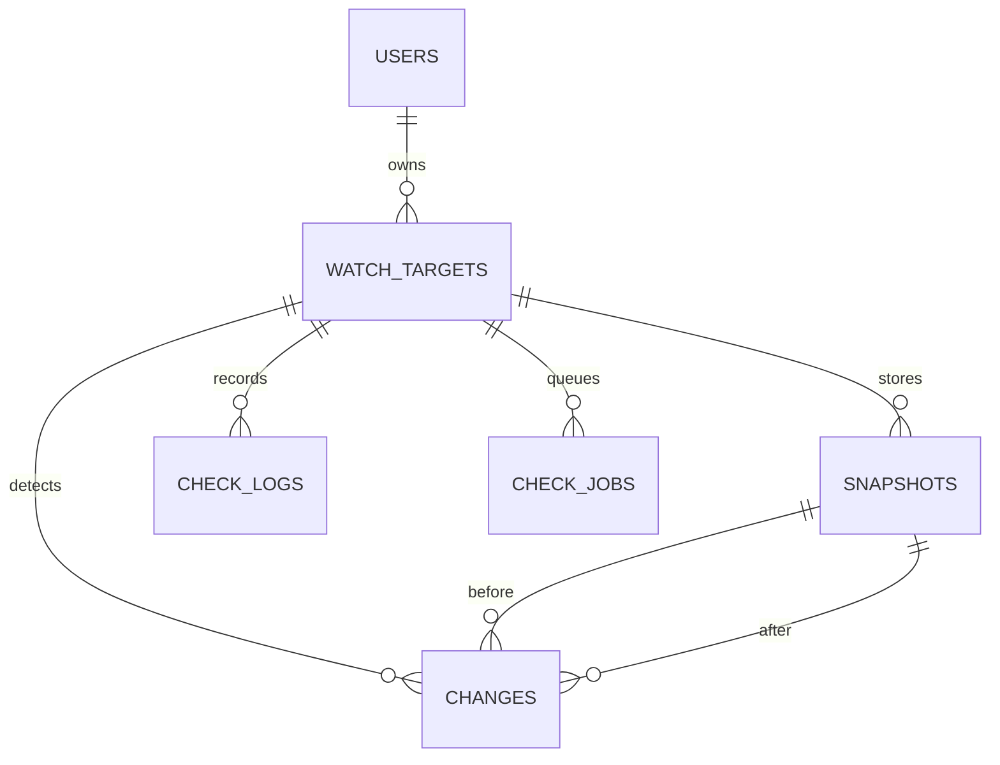

# PageWatch 配置図

## 1. 本番システム配置

APIはURL登録と結果返却に専念する。外部WebページへアクセスするのはWorkerである。CronはWebページを取得せず、`next_check_at` を過ぎた監視対象のジョブを作って終了する。

## 2. Railwayプロジェクト内の配置

| 領域 | 配置物 | 外部公開 | 主な環境変数 |
|---|---|---:|---|
| API Service | `app.main:app` | する | `DATABASE_URL`, `DEVICE_TOKEN_PEPPER`, `PORT` |
| Worker Service | `app.worker` | しない | `DATABASE_URL`, `DEVICE_TOKEN_PEPPER`, 取得制限 |
| Cron Service | `app.jobs.enqueue_due` | しない | `DATABASE_URL`, `DEVICE_TOKEN_PEPPER` |
| PostgreSQL | 6テーブル | しない | Railwayが接続情報を供給 |

## 3. リポジトリ配置

主要ファイル:

| パス | 役割 |
|---|---|
| `app/main.py` | HTTP API |
| `app/models.py` | DBテーブル |
| `app/services/url_security.py` | URL正規化、DNS・IP検査 |
| `app/services/fetcher.py` | IP固定接続、転送・容量・時間制限 |
| `app/services/extractor.py` | HTMLから本文文字を抽出 |
| `app/services/differ.py` | 行単位の追加・削除比較 |
| `app/services/checker.py` | 1回の監視処理 |
| `app/services/jobs.py` | ジョブ投入・取得・完了 |
| `app/worker.py` | 常駐Worker |
| `app/jobs/enqueue_due.py` | Railway Cron入口 |
| `ios/PageWatch` | iPhone画面と通信 |

## 4. iPhone画面配置

### ホーム

| 位置 | 要素 | 動作 |
|---|---|---|
| 上部左 | 一括更新 | 有効な登録URLを順番に手動確認 |
| 上部中央 | PageWatch | 画面タイトル |
| 上部右 | ＋ | URL登録画面を開く |
| 概要欄 | 変更あり件数・最終確認 | 現在の要約 |
| 一覧 | 状態点・ページ名・状態・確認時刻 | タップで詳細 |
| 行を右へスワイプ | 確認 | そのURLを手動確認 |
| 行を左へスワイプ | 削除 | 関連履歴を含め削除 |

### URL登録

| セクション | 要素 |
|---|---|
| Webページ | ページ名、URL |
| 分類と確認頻度 | カテゴリー、1日1/3/6回 |
| 注意 | ログイン・CAPTCHA・取得禁止ページは対象外 |
| ナビゲーション | キャンセル、登録 |

### 監視詳細

| セクション | 要素 |
|---|---|
| 状態 | 状態、カテゴリー、頻度、最終確認、エラー |
| 元ページ | Safariで元URLを開く |
| 変更履歴 | 新しい変更から最大50件 |
| 操作 | 一時停止/再開、今すぐ確認 |

設定画面の最下部には「登録データをすべて削除」を配置し、確認後に匿名端末、登録URL、本文、差分、ログ、ジョブを連鎖削除する。

### 変更詳細

| 順番 | 要素 |
|---:|---|
| 1 | 追加された文章 |
| 2 | 削除された文章 |
| 3 | 変更前の全文 |
| 4 | 変更後の全文 |
| 5 | 元ページを開く |

## 5. 監視処理の配置

## 6. データ配置

