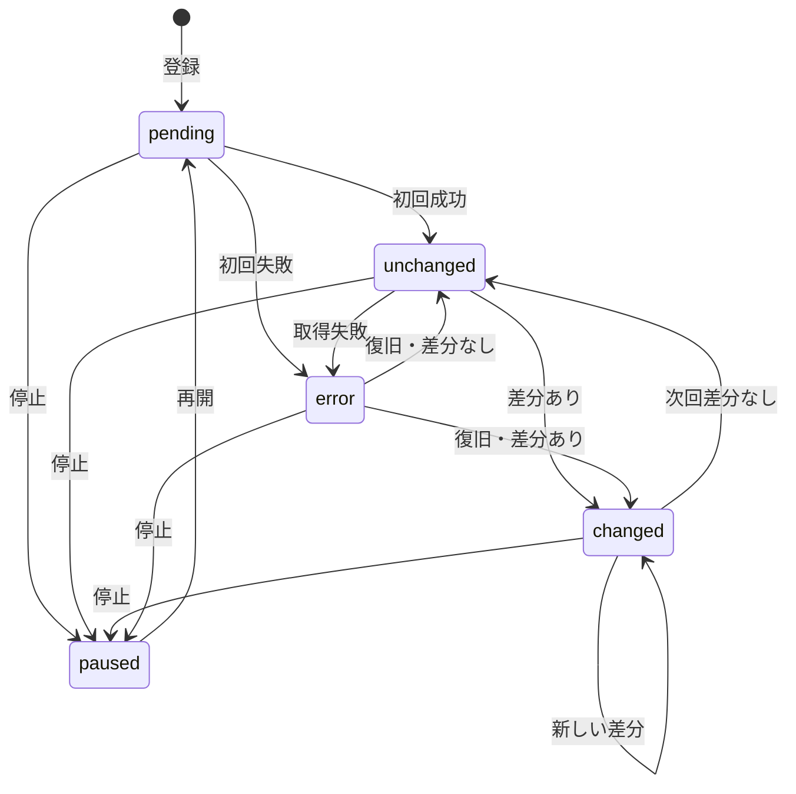
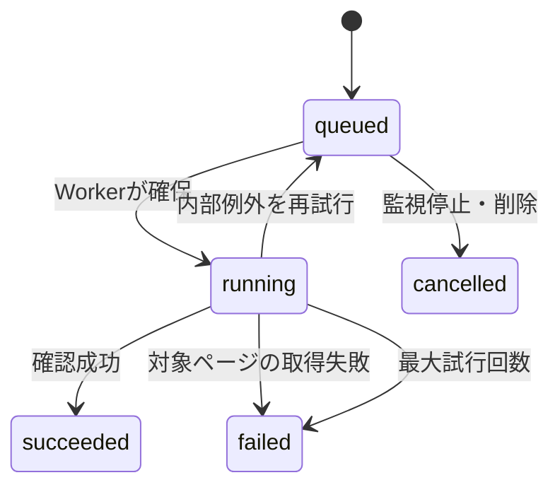

# PageWatch 詳細設計書

## 1. 初版の確定仕様

| 項目 | 確定値 |
|---|---|
| 対象 | 公開Webページの文字情報 |
| 登録上限 | 1匿名端末5件 |
| 頻度 | 24時間、8時間、4時間間隔 |
| 手動確認 | 1URLにつき5分に1回 |
| 認証 | サーバー発行匿名トークン |
| トークン保存 | iPhone Keychain |
| 画像・動画・レイアウト | 比較対象外 |
| ログイン・CAPTCHA | 対象外 |
| 通知・課金・AI要約 | 初版対象外 |
| 差分単位 | 正規化後の行 |
| 取得上限 | 2MB、15秒、3リダイレクト |
| 本文保存上限 | 300,000文字 |
| 差分表示上限 | 追加・削除各100,000文字 |

## 2. 元仕様からの設計補強

### 匿名端末認証

端末がUUIDだけを送る方式では、値を知った第三者が他人の監視一覧へアクセスできる。初回起動時に推測困難なトークンをAPIが発行し、iPhoneはKeychainに保存する。DBには `DEVICE_TOKEN_PEPPER` と組み合わせたSHA-256だけを保存する。

### データベース式ジョブキュー

Redisを増やさず、PostgreSQLの `check_jobs` をキューとして利用する。`SELECT FOR UPDATE SKIP LOCKED` により複数Workerでも同じジョブを処理しない。部分ユニークインデックスにより、1URLの待機中・実行中ジョブは1件に限定する。

### SSRF防止

自由入力URLをサーバーが取得するため、通常のURL形式確認だけでは不十分である。

1. HTTP/HTTPSだけ許可する。
2. URL内のユーザー名・パスワードを拒否する。
3. 80/443以外を拒否する。
4. localhost系ドメインを拒否する。
5. DNSの全解決結果が公開IPであることを確認する。
6. 検査済みIPへ直接接続する。
7. TLS証明書は元ホスト名で検証する。
8. リダイレクト先も1から再検査する。

### 容量抑制

変更なしのたびに全文を保存しない。初回と変更時だけ `snapshots` を追加し、各確認は小さい `check_logs` に記録する。

## 3. 状態設計

### 監視対象

### 確認ジョブ

取得拒否や404は、そのURLについて正しく判定できた結果なのでジョブを `failed` にして監視対象へ理由を残す。DB切断など処理基盤側の例外だけ再試行する。

## 4. API

すべてJSON。`/health`、`/`、匿名端末発行以外は `Authorization: Bearer <token>` が必要。

| Method | Path | 成功 | 役割 |
|---|---|---:|---|
| POST | `/api/devices/anonymous` | 201 | 匿名端末トークン発行 |
| POST | `/api/watches` | 201 | URL登録と初回ジョブ作成 |
| GET | `/api/watches` | 200 | 登録一覧 |
| GET | `/api/watches/{id}` | 200 | 監視詳細 |
| PATCH | `/api/watches/{id}` | 200 | 名称・分類・頻度・停止を更新 |
| DELETE | `/api/watches/{id}` | 204 | 関連データを含め削除 |
| POST | `/api/watches/{id}/check` | 202 | 手動ジョブを作成 |
| GET | `/api/check-jobs/{id}` | 200 | ジョブ状態 |
| GET | `/api/watches/{id}/changes` | 200 | 変更履歴50件 |
| GET | `/api/watches/{id}/changes/{change_id}` | 200 | 差分と変更前後 |
| GET | `/api/account/usage` | 200 | 登録数と上限 |
| DELETE | `/api/account` | 204 | 匿名端末と全関連データを削除 |
| GET | `/health` | 200 | DB接続を含む死活確認 |

代表エラー:

| HTTP | 意味 | アプリ表示 |
|---:|---|---|
| 401 | トークンなし・無効 | 認証情報が無効 |
| 404 | 自分の対象・履歴がない | 見つからない |
| 409 | 5件上限、重複、停止中 | 理由をそのまま表示 |
| 422 | URL・入力不正 | 修正内容を表示 |
| 429 | 5分以内の再確認 | 残り秒数を表示 |

## 5. テーブル

### users

| 列 | 型 | 制約 |
|---|---|---|
| id | UUID文字列 | PK |
| device_token_hash | 64文字 | UNIQUE |
| created_at / updated_at | timestamptz | 必須 |

### watch_targets

| 列 | 型 | 用途 |
|---|---|---|
| user_id | FK | 所有者 |
| title / url | 文字 | 表示名、正規化URL |
| url_hash | 64文字 | 端末内重複確認 |
| category / frequency | 文字 | 分類、間隔 |
| is_active | bool | 停止状態 |
| last_check_status | 文字 | 一覧状態 |
| last_error | 最大500文字 | 利用者向け理由 |
| last_checked_at | timestamptz | 5分制限・表示 |
| next_check_at | timestamptz | Cron判定 |

`(user_id, url_hash)` はUNIQUE。

### snapshots

初回または変更時だけ保存する。本文、本文hash、HTTP状態、確認日時を持つ。

### changes

変更前後のsnapshot ID、追加文章、削除文章、差分省略フラグ、変更日時を持つ。

### check_logs

確認元（initial/manual/scheduled）、結果、HTTP状態、エラー、日時を持つ。

### check_jobs

確認元、状態、試行回数、実行可能日時、開始・完了・エラーを持つ。`queued/running` に限り、監視対象ごとに1件だけ存在できる。

## 6. 本文抽出

初版の抽出は汎用ルールである。

除外タグ:

- `script`, `style`, `noscript`
- `svg`, `canvas`, `iframe`
- `nav`, `header`, `footer`, `aside`, `form`

除外属性候補:

- `aria-hidden=true`, `hidden`
- `display:none`, `visibility:hidden`
- id/classにcookie、consent、advert、social等の独立語を含む要素

正規化:

- CRLFとCRをLFへ統一
- 行内の連続空白を1個へ統一
- 空行を除く
- 直前と同じ行の連続を1行へ統一

これは全サイトへ完全対応する方式ではない。誤検知が多いサイトには、公開後に「CSSセレクタ指定」「キーワード指定」「サイト専用抽出」を追加する。

## 7. 失敗の局所化

| 失敗 | 影響範囲 | 対応 |
|---|---|---|
| 1サイトが遅い | Workerの1ジョブ | タイムアウト、次ジョブへ |
| 不正URL | その登録要求 | 422で拒否 |
| 対象サイトが拒否 | その監視対象 | error表示 |
| Worker停止 | 確認処理のみ | queuedがDBに残り再開後処理 |
| Cron失敗 | 新規定期ジョブのみ | 次回Cronで再判定 |
| API再起動 | 操作中通信のみ | DBの登録・ジョブは維持 |
| PostgreSQL停止 | 全機能 | Healthcheck失敗、復旧待ち |

`running` のまま10分を超えたジョブはWorker起動時とCron起動時に回収する。最大試行回数未満なら `queued` に戻し、上限到達なら `failed` にする。

## 8. 未実装

- Push通知
- 課金
- AI要約
- CSSセレクタ指定
- JavaScriptレンダリング
- 画像比較
- 複数端末同期
- 管理画面
- 保存期間の自動削除
- 対象サイト別アダプター

## 9. 公開前に決める値

| 項目 | 現在 | 公開前 |
|---|---|---|
| Bundle ID | `com.pagewatch.app` | Apple登録値 |
| API URL | プレースホルダー | Railway公開URL |
| User-Agent連絡URL | プレースホルダー | サポートURL |
| 利用規約URL | example.com | 正式URL |
| プライバシーURL | example.com | 正式URL |
| 問い合わせURL | example.com | 正式URL |
| Token pepper | 開発は空可 | 32文字以上の乱数 |
